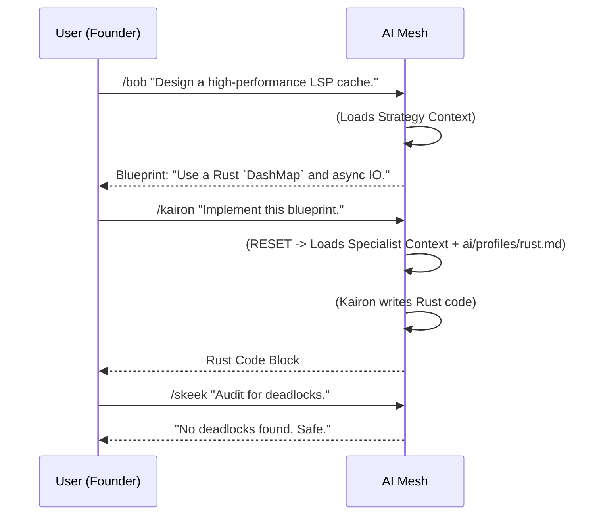

# Æmacs: The Iron Core Editor

<!-- markdown-toc start - Don't edit this section. Run M-x markdown-toc-refresh-toc -->
**Table of Contents**

- [Æmacs: The Iron Core Editor](#macs-the-iron-core-editor)
  - [The Vision: Beyond the Terminal](#the-vision-beyond-the-terminal)
  - [Quick-Start Tutorials](#quick-start-tutorials)
    - [🔥 Level 1: The Forge (Core Architecture)](#-level-1-the-forge-core-architecture)
    - [🧠 Level 2: The Neural Mesh (AI Integration)](#-level-2-the-neural-mesh-ai-integration)
    - [⚡ Level 3: High-Performance Services (Go & Backend)](#-level-3-high-performance-services-go--backend)
    - [🎨 Level 4: The Prism (UI & Rendering)](#-level-4-the-prism-ui--rendering)
    - [🏛️ Level 5: Legacy & Migration](#-level-5-legacy--migration)
    - [🛡️ Level 6: Process & Quality](#-level-6-process--quality)
  - [The Unified AI Model (MAS)](#the-unified-ai-model-mas)
  - [The "Iron Core" Architecture](#the-iron-core-architecture)
  - [The Agent Roster (The Pantheon)](#the-agent-roster-the-pantheon)
    - [Strategic Council (General AI)](#strategic-council-general-ai)
    - [Implementation Specialists (Coding AI)](#implementation-specialists-coding-ai)
    - [Synthetic Stakeholders (Simulation)](#synthetic-stakeholders-simulation)
  - [How to Use This System (Unified CLI Workflow)](#how-to-use-this-system-unified-cli-workflow)
  - [⚙️ AI Framework Maintenance (The Build Pipeline)](#-ai-framework-maintenance-the-build-pipeline)

<!-- markdown-toc end -->

## The Vision: Beyond the Terminal
Æmacs is not just an editor; it is a **Cybernetic Environment**.
It fuses the modal efficiency of Vim, the extensibility of Emacs, and the raw power of a **Rust Kernel** (The Iron Core) with a native **AI Mesh**.

* **Speed:** 120fps rendering via GPUI. No more GC pauses.
* **Safety:** Memory-safe Rust core.
* **Intelligence:** AI is a first-class citizen, integrated into the event loop via MCP.

## Quick-Start Tutorials
New to Æmacs? Start here.

### 🔥 Level 1: The Forge (Core Architecture)
* **[Tutorial 1: The Iron Core](tutorials/01_rust_core.md)** - Understanding the Rust Kernel and `tokio` event loop.
* **[Tutorial 2: Extending with WASM](tutorials/02_wasm_plugins.md)** - Writing safe, high-speed plugins in Rust/WASM.

### 🧠 Level 2: The Neural Mesh (AI Integration)
* **[Tutorial 3: The AI Mesh](tutorials/03_ai_mesh.md)** - How to use the unified agent system (Kairon, Nagah).
* **[Tutorial 4: Python Scripting](tutorials/04_python_glue.md)** - Using **Nagah** to write data science scripts and glue code.

### ⚡ Level 3: High-Performance Services (Go & Backend)
* **[Tutorial 5: Cloud Sync](tutorials/05_cloud_sync.md)** - Building backend services with **Bwah** (Go).
* **[Tutorial 6: Formal Verification](tutorials/06_verification.md)** - Ensuring logic correctness with **The Resonance** (Haskell).

### 🎨 Level 4: The Prism (UI & Rendering)
* **[Tutorial 7: GPUI & Shaders](tutorials/07_gpui_shaders.md)** - Creating 120fps UI elements with **Bzzrts**.
* **[Tutorial 8: Theming](tutorials/08_theming.md)** - Designing vector-based themes.

### 🏛️ Level 5: Legacy & Migration
* **[Tutorial 9: The Legacy Bridge](tutorials/09_legacy_bridge.md)** - Running old Elisp packages inside the sandbox with **Spacky**.

### 🛡️ Level 6: Process & Quality
* **[Tutorial 10: Testing & QA](tutorials/10_testing_and_qa.md)** - Fighting the Gauntlet with Don Testote.
* **[Tutorial 11: Git Workflow](tutorials/11_git_workflow.md)** - Professional Commit Messages with G.O.L.E.M.
* **[Tutorial 12: Code Review](tutorials/12_code_review.md)** - The 4D Audit (Logic, Security, Style).
* **[Tutorial 13: CI Pipelines](tutorials/13_ci_pipelines.md)** - Setting up GitHub Actions with Vala.

## The Unified AI Model (MAS)
We utilize a **Unified Agentic Workflow**. All agents reside in your CLI/Editor, separated by logical personas.

1.  **The Strategist (`general_ai.md`):** High-level reasoning & Planning.
2.  **The Specialist (`coding_ai.md`):** Concrete Implementation (Rust, Python, Go).
3.  **The Simulator (`stakeholder_ai.md`):** Adversarial Feedback.

> **CRITICAL USAGE RULE: ONE COMMAND = ONE MINDSET**
> Use **Slash Commands** (`/agent`) to switch contexts cleanly.
> * `/kaelthas` -> Loads Strategy Context.
> * `/kairon` -> Resets & Loads Rust Coding Context.

## The "Iron Core" Architecture
The framework is built on the **Artisan + Toolbox** model.

1.  **The Artisan (`coding_ai.md`):** The Persona (e.g., **Kairon**, **Nagah**). Defines *behavior*.
2.  **The Toolbox (`ai/profiles/*.md`):** The Technical Rules (e.g., `rust.md`). Defines *constraints*.

**You must always provide both!** (The system does this automatically via `sync-agents.py`).

## The Agent Roster (The Pantheon)

### Strategic Council (General AI)
*The Architects of the Vision.*

| Agent Name          | Role          | Primary Task                               |
|:--------------------|:--------------|:-------------------------------------------|
| **Prof. McKarthy**  | Teacher       | Default Persona. Explains Concepts.        |
| **Scribe Veridian** | Docs Writer   | Writes Tutorials & Guides.                 |
| **Griznak**         | Release       | Manages Versioning & Changelog.            |
| **Orb**             | Community     | Announcements & Feedback.                  |
| **Kallista**        | UI Auditor    | Checks Compliance (Grid/Keys).             |
| **Kael'Thas**       | Project Owner | The Iron Regent. Defines the Vision.       |
| **Bob**             | Architect     | Designs the Structure (Rust/Architecture). |
| **Magos Pixelis**   | UI Designer   | Designs the Visual Concept (GPUI).         |
| **Lector Lumen**    | Triage        | Sorts Issues.                              |
| **Freud**           | Requirements  | Analyzes User Needs.                       |
| **Reginald Shoe**   | CI Specialist | Designs Pipeline Strategy.                 |

### Implementation Specialists (Coding AI)
*The Builders of the Forge.*

| Agent Name      | Role            | Primary Task                      | Toolbox (in `ai/profiles/`) |
|:----------------|:----------------|:----------------------------------|:----------------------------|
| **Kairon**      | Rust Core       | Kernel, GPUI, WASM Host.          | `rust.md`                   |
| **Nagah**       | Python/AI       | AI Glue & Scripts.                | `python.md`                 |
| **Bwah**        | Backend (Go)    | Microservices & Sync.             | `go.md`                     |
| **Resonance**   | Logic (Haskell) | Parsers & Verification.           | `haskell.md`                |
| **Zolg**        | Apps (Clojure)  | Rich Data Applications.           | `clojure.md`                |
| **Spacky**      | Legacy Bridge   | Old Elisp compatibility.          | `elisp.md`                  |
| **Bzzrts**      | GPU UI          | Shaders & Animations.             | `gfx.md`                    |
| **Vala**        | CI/CD           | Pipelines.                        | `ci_github.md`              |
| **Marjin**      | Refactorer      | Cleans & Optimizes code.          | `any`                       |
| **Nexus-7**     | Deps            | Layers & Packages.                | `layers.md`                 |
| **G.O.L.E.M.**  | Docs            | Documentation & Style.            | `doc.md`                    |
| **Don Testote** | QA              | Testing (All Languages).          | `*_testing.md`              |
| **Skeek**       | Security        | Audits Code for Vulnerabilities.  | `*_testing.md`              |
| **Dok**         | Debugger        | Analyzes Backtraces & Fixes Bugs. | `any`                       |

### Synthetic Stakeholders (Simulation)
*The Adversaries.*

| Persona      | Archetype      | Bias                     |
|:-------------|:---------------|:-------------------------|
| **Dr. Chen** | Data Scientist | Python, Reproducibility. |
| **Vlad**     | Vim User       | Speed, Keystrokes.       |
| **Noobie**   | Beginner       | Usability, Confusion.    |
| **RMS-Fan**  | Purist         | Freedom, Elisp-only.     |
| **Sarah**    | Enterprise     | Stability, Java.         |

## How to Use This System (Unified CLI Workflow)

1.  **Install:** Run `python ai/sync-agents.py`.
2.  **Interact:**
    * Need a plan? -> `/bob`
    * Need Rust code? -> `/kairon`
    * Need Python? -> `/nagah`
    * Need to fix Legacy? -> `/spacky`

## ⚙️ AI Framework Maintenance (The Build Pipeline)

We compile our agents from three source maps in `ai/`:
1.  **`coding_ai.md`:** The Specialists.
2.  **`general_ai.md`:** The Strategists.
3.  **`stakeholder_ai.md`:** The Simulators.

The **Toolbox Profiles** live in `ai/profiles/`.

**To Update:**
1.  Edit the source file.
2.  Run `python ai/sync-agents.py`.
3.  Commit changes.
